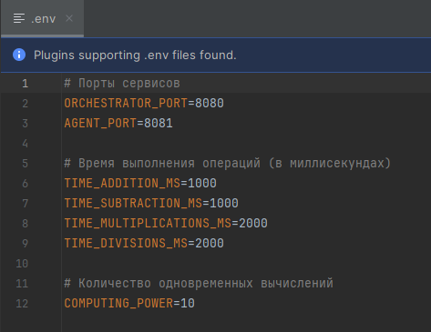
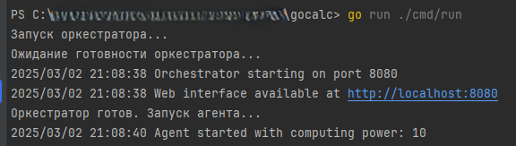
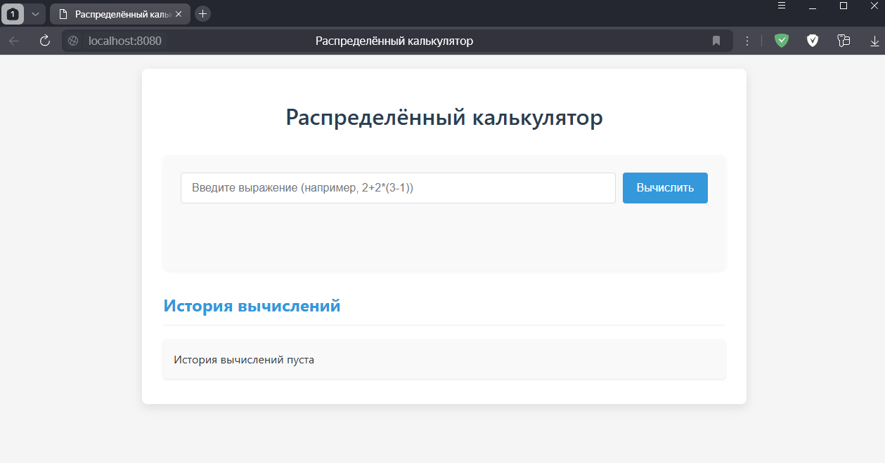
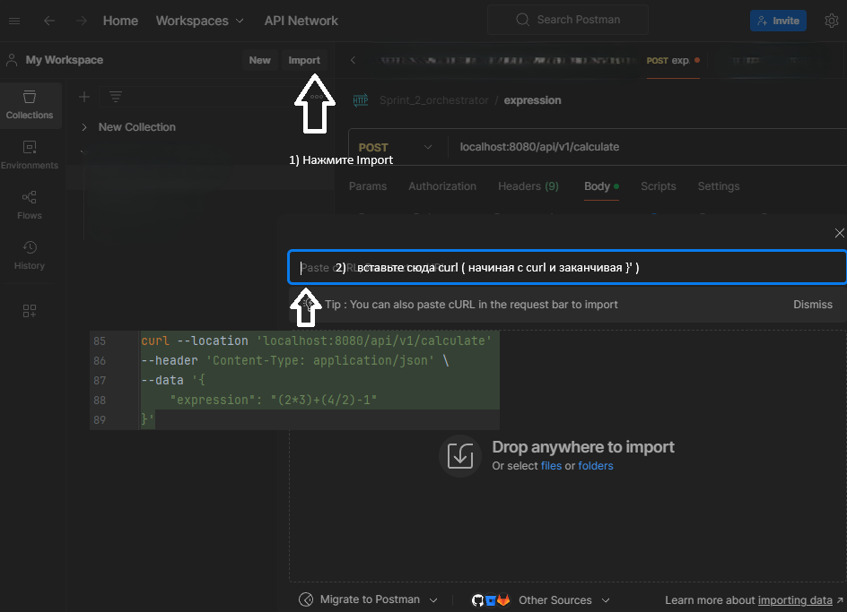
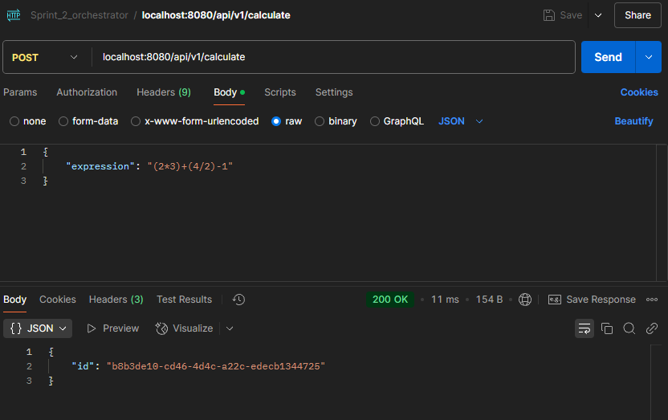
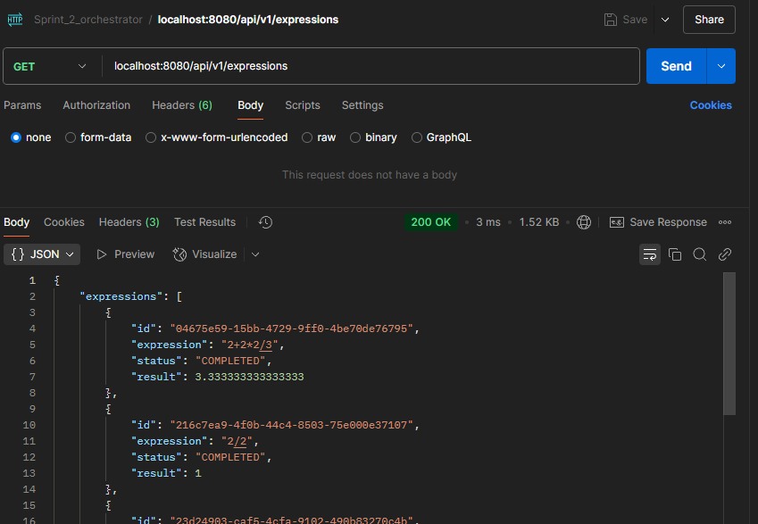
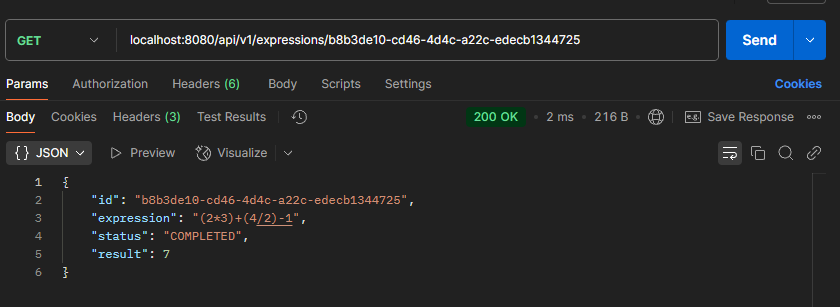

# Распределённый калькулятор арифметических выражений

Проект представляет собой распределённую систему для вычисления арифметических выражений. Система состоит из двух микросервисов:
1. Оркестратор (orchestrator) - принимает выражения от пользователей, разбивает их на подзадачи и координирует их выполнение
2. Агент (agent) - выполняет отдельные арифметические операции

## Требования

- Go 1.21 или выше
- Доступ к портам 8080 и 8081 (можно изменить в файле .env)

## Установка

1. Клонируйте репозиторий:
```bash
git clone https://github.com/yourusername/calculator-service.git
cd calculator-service
```

2. Установите зависимости:
```bash
go mod download
```

## Конфигурация

Все настройки хранятся в файле `.env`. Вы можете изменить:
- Порты сервисов
- Время выполнения операций
- Количество одновременных вычислений (COMPUTING_POWER)
- 

## Запуск
### Запуск одной командой

Для запуска Калькулятора выполните следующую команду. Скопируйте команду и вставьте ее в терминал и нажмите Enter:

```bash
go run ./cmd/run
```

Эта команда запустит оба сервиса параллельно в одном терминале и обеспечит корректное завершение обоих процессов при нажатии Ctrl+C. Работает как на Windows, так и на macOS/Linux. Пример выполненной команды в терминале Goland представлен на скриншоте ниже


> **Важно:** Команду необходимо выполнять из корневой директории проекта, где находится файл `go.mod`. В данном случае убедитесь что в терминале у вас указана директория именно PS C:\........\gocalc>


### Запуск двумя командами
#### Если по каким-то причинам вы не смогли запустить сервис "одной командой" указанной выше, то можно запустить оркестратор и агент по отдельности

1. Запустите оркестратор:
```bash
go run ./cmd/orchestrator
```

2. В другом терминале запустите агент:
```bash
go run ./cmd/agent
```

## Веб-интерфейс

Проект включает веб-интерфейс для работы с калькулятором:

1. После запуска оркестратора и агента откройте в Калькулятор браузере по адресу:
```
http://localhost:8080
```


2. В открывшемся интерфейсе вы можете:
   - Вводить арифметические выражения в текстовое поле (+ сложение, - вычитание, / деление, * умножение)
   - Нажимать кнопку "Вычислить" или клавишу Enter для расчёта
   - Видеть результат вычисления и его статус
   - Просматривать историю вычислений
   - Повторно использовать выражения из истории, кликнув по ним

Веб-интерфейс автоматически обновляет статус вычислений и отображает результаты, как только они становятся доступны.

## API Endpoints

### Публичные endpoints

1. Отправка выражения на вычисление:
Можно выполнить данные запросы в Postman перейдя на вкладку Body



2. 
```bash
curl --location 'localhost:8080/api/v1/calculate' \
--header 'Content-Type: application/json' \
--data '{
    "expression": "(2*3)+(4/2)-1"
}'
```

3. Получение списка всех выражений:
```bash
curl --location 'localhost:8080/api/v1/expressions'
```


4. Получение информации о конкретном выражении:
```bash
curl --location 'localhost:8080/api/v1/expressions/{id}'
```


### Внутренние endpoints (для взаимодействия сервисов)

1. Получение задачи агентом:
```bash
curl --location 'localhost:8080/internal/task'
```

2. Отправка результата задачи:
```bash
curl --location 'localhost:8080/internal/task' \
--header 'Content-Type: application/json' \
--data '{
    "id": "task-id",
    "result": 4
}'
```

## Особенности реализации

- Оркестратор разбивает выражения на подзадачи с помощью AST (Abstract Syntax Tree)
- Агент использует горутины для параллельного выполнения операций
- Количество одновременных вычислений ограничивается параметром COMPUTING_POWER
- Каждая операция имитирует время выполнения через настраиваемые задержки

## Структура проекта

```
gocalc/
├── cmd/
│   ├── agent/
│   │   ├── main.go            # Точка входа для агента
│   │   └── processor.go       # Обработка арифметических задач
│   ├── calc_service/
│   │   └── main.go            # Точка входа для сервиса калькулятора
│   ├── orchestrator/
│   │   └── main.go            # Точка входа для оркестратора
│   ├── run/
│   │   └── main.go            # Запускает оркестратор и агент параллельно
│   └── web/                   # Директория для веб-интерфейса
│       ├── static/
│       │   ├── css/
│       │   │   └── styles.css
│       │   ├── js/
│       │   │   └── main.js
│       │   └── index.html
├── internal/                  # Внутренняя логика приложения
│   ├── api/                   # API-интерфейс калькулятора
│   │   ├── handler.go
│   │   └── response.go
│   ├── calculator/            # Модуль калькулятора
│   │   └── calculator.go      # Основная логика калькулятора
│   ├── models/                # Модели данных
│   │   └── models.go
│   ├── orchestrator/          # Логика оркестратора
│   │   └── handlers.go
│   ├── parser/                # Парсер арифметических выражений
│   │   └── parser.go
│   └── types/                 # Общие типы данных
│       └── types.go
├── orchestrator/              # Дополнительные компоненты оркестратора
│   └── internal/
│       └── models/
│           └── models.go
├── tests/                     # Тесты приложения
│   ├── agent_test.go
│   ├── api_test.go
│   ├── calculator_test.go
│   ├── handlers_test.go
│   ├── integration_test.go
│   └── parser_test.go
├── .env                       # Переменные окружения
├── go.mod
├── go.sum
├── docs/
│   └── images/                # Изображения для документации
└── README.md                  # Документация проекта
```

## Тестирование

Для запуска тестов выполните в терминале следующую команду(скопируйте, вставьте в терминал и нажмите enter):
```bash
go test -v ./tests
```
- `agent_test.go` - Тесты для функциональности агента.
- `api_test.go` - Тесты для API-интерфейса.
- `calculator_test.go` - Тесты для логики калькулятора.
- `handlers_test.go` - Тесты для HTTP-обработчиков.
- `integration_test.go` - Интеграционные тесты системы.
- `parser_test.go` - Тесты для парсера выражений.

После выполнения команды вы увидите подробный отчет о каждом тесте:
- Имя теста и его статус (PASS/FAIL)
- Время выполнения каждого теста
- Подробная информация об ошибках, если они есть
- В конце отчета будет представлена сводная информация:
  - Общее количество пройденных тестов
  - Процент покрытия кода тестами
  - Общее время выполнения всех тестов

PASS
ok    calculator-service/tests    1.000s